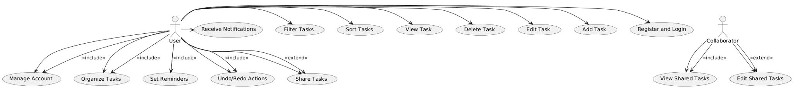

# The Project

The project provides you an opportunity to build upon the foundational knowledge acquired in this course. It is designed to help you develop an advanced understanding of software engineering principles, tools, and techniques using structured requirements gathering and analysis, software development process, design patterns, software architecture, and software testing. You will also need to consider your development methodology (don’t use waterfall), software metrics, and software quality assurance.

As a team, you will select a project, develop a set of requirements, conduct a formal analysis of the project, develop an architecture, and then using TDD and an Agile workflow, iterate and develop your projects. During your project, you MUST consider design patterns and anti-patterns, TDD, dockerization, and CI/CD. The goal is not necessarily to build a complex system, but to practice and become comfortable with the techniques, be able to analyze and decompose a problem, and incrementally develop and deploy a solution using a branching workflow. The systems needs to be properly planned, analyzed, modelled and implement.

Internally, within your team, you are free to manage efforts and tasks with the understanding that everyone is expected to contribute equally in some fashion. During the project, you will have the chance to confidentially conduct peer reviews using the credit-earned model (see document on Canvas regarding this) at a number of key points. Your individual project grade will be impacted using the results of the peer evaluation. The key point is that if you don’t contribute to the project, your mark will reflect this. This will be discussed in class.

**You must have:**

- Unit tests and integration tests to ensure code quality and functionality
- A CI to automatically test
- Set of user requirements, identified user groups, and developed use-cases
- Identified what design patterns you are using and describe why
- Dockerized deployment
- Continual and ongoing work using TDD
- A team between 3-5 people (no more, no less) - target for 4

**Stretch goals:**

- CD pipeline to deploy changes to the codebase

## Project Goals:

- To deepen the students' understanding of software engineering principles, tools, and techniques.
- To enable students to apply software engineering principles, tools, and techniques to the development of complex software systems.
- To introduce students to agile development methodologies, software metrics, and software quality assurance.
- To foster collaboration and teamwork among students in the development of software systems.

The goal is to be able to build good code quickly (using the proper processes). Remember: **Perfect is the enemy of good**

Build incrementally with this in mind, making small and incremental improvements.

## Project Objectives:

By the end of this project, students will be able to:

- Apply the software development process model, to the development of a software system
- Design software systems using appropriate design patterns and principles
- Develop software architectures for complex software systems
- Use software testing techniques to ensure the quality of software systems
- Apply agile development methodologies to the development of software systems
- Apply software metrics to evaluate the quality of software systems
- Develop software quality assurance plans to ensure the quality of software systems
- Apply and develop a CI/CD pipeline for automated testing and deployment
- Utilize dockerization to containerize your application
- Work collaboratively in teams to develop software systems

**Peer Evaluation:** see [Peer Evaluation](https://canvas.ubc.ca/courses/150415/pages/peer-evaluation?wrap=1)

## Evaluation:

See Canvas for [details](https://canvas.ubc.ca/courses/150415/pages/the-project).

## The Projects (all are web apps):

**Your team MUST select one of the these projects.** Please take the time to review the details for each.

**Todo App:** Develop a basic to-do list app that allows users to manage tasks. Users can add, edit, delete tasks, and organize them by categories or due dates. Users will also be able to share (view/edit) with other users. The system needs to allow tasks to be organized into custom categories (e.g., Work, Personal) as well as support optional due dates with simple reminders or alerts. Users will be able to ssign priority to tasks (e.g., High, Medium, Low) as well as view tasks based on categories, priorities, or due dates. The platform should incorporate the Command Pattern to implement undo and redo functionalities for task actions, the Observer Pattern to update task lists dynamically when changes occur and the Strategy Pattern for sorting algorithms based on different criteria. Additionally, the platform should incorporate Continuous Integration (CI) and automated testing.

**Flashcard Study App:** Create a simple flashcard application that allows users to create, edit, and review flashcards for studying. The app supports text-based cards and simple categorization into decks. With the online system, users will be able to create and organize flashcards into decks by subject or topic. They will be able to create flashcards but adding questions and answers to flashcards. The system will have a study mode that will allow flashcards to be reviewed in order or in a randomized fashion. The system will also allow for progress tracking, allowing users to mark flashcards as known or unknown so progress can be tracked. Users will also allow their flashcards to be shared with other users or publicly as well as having the ability to share decks with others via simple file formats. The platform should incorporate the Factory Pattern for creating different types of flashcards or decks, the Iterator Pattern to navigate through flashcards efficiently and the Singleton Pattern to manage user settings or session data. Additionally, the platform should incorporate Continuous Integration (CI) and automated testing.

**Weather Forecast Application:** Build a simple application that displays current weather information and a 5-day forecast for a user-selected location using a public weather API. Users will need to create an account so they can access and edit their dashboard as well as being able to share it with other users. The system must support location search where users can search for weather information by city name as well as display the current weather showing temperature, weather conditions, and an icon representing the weather (with the user being able to select formats/options for how data is displayed). The system will also show a 5-day forecast which will display basic forecast information for the next five days. Users will also be able to save favourite locations for quick access on their dashboard as well as being able to save and share with other users. The platform should incorporate the Adapter Pattern to interface with the external weather API. the Singleton Pattern to manage a single instance of the API client and the Facade Pattern to simplify the interface for fetching and displaying weather data. Additionally, the platform should incorporate Continuous Integration (CI) and automated testing.

**Discord Clone:** This project involves the development of a web-based platform for online communication and collaboration, similar to the popular chat app, Discord. The platform should incorporate the Observer design pattern to notify users of new messages, and the Mediator design pattern to manage communication between users and channels. The platform should also implement the Singleton design pattern to ensure that only one instance of the chat server is running at any given time, and the Command design pattern to enable users to execute commands (e.g. change username, join channel). Additionally, the platform should incorporate Continuous Integration (CI) and automated testing.

## Statement on the Use of GitHub Copilot and Generative AI Tools

Students are permitted and encouraged to utilize AI-powered tools such as GitHub Copilot and other generative AI assistants for coding, user interface (UI), and user experience (UX) design aspects of their projects. These tools can serve as valuable resources to enhance productivity, inspire creativity, and assist in overcoming technical challenges. The focus of the project is to develop and improve skills surrounding the process of developing software BUT the team must observe the process and work in an iterative fashion using TDD.

Please see further detals on Canvas in for [Guidelines for Responsible Use](https://canvas.ubc.ca/courses/150415/pages/the-project)

# Project - ToDo App

## **1. Description**

Develop a user-friendly to-do list application that allows users to manage tasks effectively. The app will enable users to add, edit, delete, and organize tasks by custom categories, priorities, and due dates. It will support task sharing with other users and incorporate undo/redo functionality, dynamic updates, and sorting algorithms using design patterns. Continuous Integration (CI) and automated testing will be implemented to ensure code quality and reliability.

---

## **2. User Requirements**

### **2.1 Task Management**

- **Add Tasks**: Users can create new tasks with titles, descriptions, due dates, priorities, and categories.
- **Edit Tasks**: Users can modify existing task details.
- **Delete Tasks**: Users can remove tasks from their list.
- **View Tasks**: Users can view tasks filtered by categories, priorities, or due dates.
- **Organize Tasks**: Users can sort tasks based on different criteria (e.g., due date, priority).

### **2.2 Task Organization**

- **Custom Categories**: Users can create and assign tasks to custom categories (e.g., Work, Personal).
- **Set Priorities**: Users can assign priority levels to tasks (High, Medium, Low).
- **Due Dates and Reminders**: Users can set optional due dates and receive reminders or alerts.

### **2.3 Collaboration**

- **Share Tasks**: Users can share tasks or task lists with other users with view or edit permissions.

### **2.4 Undo/Redo Functionality**

- **Command Pattern Implementation**: Users can undo or redo actions performed on tasks.

### **2.5 Dynamic Updates**

- **Observer Pattern Implementation**: Task lists update dynamically when changes occur, reflecting real-time updates.

### **2.6 Sorting Options**

- **Strategy Pattern Implementation**: Users can choose different sorting algorithms for task lists.

---

## **3. Functional Requirements**

### **3.1 User Account Management**

- **Registration and Authentication**: The system will allow users to register and log in securely.
- **Profile Management**: Users can manage their account settings and preferences.

### **3.2 Task Operations**

- **CRUD Operations**: The system will support Create, Read, Update, and Delete operations for tasks.
- **Category Management**: Users can create, edit, and delete custom categories.

### **3.3 Collaboration Features**

- **Sharing Mechanism**: The system will enable task sharing with specific permissions (view/edit).
- **Notifications**: Users will receive notifications when shared tasks are updated.

### **3.4 Design Patterns Implementation**

- **Command Pattern**: Implement undo and redo functionalities for task actions.
- **Observer Pattern**: Ensure task lists are updated dynamically across shared views.
- **Strategy Pattern**: Provide various sorting algorithms for task organization.

### **3.5 Reminders and Alerts**

- **Due Date Reminders**: The system will send reminders or alerts for tasks with approaching due dates.

### **3.6 Continuous Integration and Testing**

- **CI Implementation**: Automated building and testing processes will be set up.
- **Automated Testing**: Unit tests, integration tests, and end-to-end tests will be implemented.

---

## **4. Non-Functional Requirements**

### **4.1 Usability**

- **User-Friendly Interface**: The app will have an intuitive and easy-to-navigate user interface.
- **Accessibility**: The design will consider accessibility standards to accommodate all users.

### **4.2 Performance**

- **Efficiency**: The app will load quickly and handle operations without noticeable delays.
- **Scalability**: The system will handle an increasing number of users and tasks without performance degradation.

### **4.3 Security**

- **Data Protection**: User data will be stored securely, with encryption where appropriate.
- **Authentication**: Secure login mechanisms will be in place to protect user accounts.

### **4.4 Reliability**

- **Error Handling**: The system will handle errors gracefully without crashing.
- **Availability**: The app will have high uptime and be available whenever users need it.

### **4.5 Maintainability**

- **Code Quality**: Code will be written following best practices to ease maintenance and updates.
- **Documentation**: Comprehensive documentation will be provided for future development.

### **4.6 Compatibility**

- **Cross-Platform Support**: The app will be accessible on various devices (e.g., desktops, tablets, smartphones).

---

## **5. Proto-Personas**

### **5.1 Persona 1: Busy Professional**

- **Name**: Alex Thompson
- **Age**: 35
- **Occupation**: Project Manager
- **Goals**:
  - Organize work tasks efficiently.
  - Prioritize tasks based on deadlines and importance.
  - Collaborate with team members by sharing task lists.
- **Frustrations**:
  - Overwhelmed by numerous tasks.
  - Difficulty in keeping track of task updates from team members.

### **5.2 Persona 2: Student**

- **Name**: Jamie Lee
- **Age**: 22
- **Occupation**: University Student
- **Goals**:
  - Manage assignment deadlines and study schedules.
  - Categorize tasks by courses.
  - Receive reminders for upcoming exams and assignments.
- **Frustrations**:
  - Forgetting assignment due dates.
  - Struggling to balance academic and personal tasks.

---

## **6. Use Case Diagram and Descriptions**

_(Note: As I cannot create visual diagrams, I will describe the use cases in text form.)_

### **6.1 Use Case: Manage Tasks**

- **Actors**: User
- **Description**: Allows the user to add, edit, delete, and view tasks.
- **Preconditions**: User is logged into the app.
- **Main Flow**:
  1. User selects the option to create a new task.
  2. Enters task details (title, description, due date, priority, category).
  3. Saves the task.
  4. Task appears in the task list.
- **Postconditions**: Task is saved and visible in the user's task list.

### **6.2 Use Case: Organize Tasks**

- **Actors**: User
- **Description**: Users can sort and filter tasks based on criteria.
- **Preconditions**: User has tasks in the list.
- **Main Flow**:
  1. User selects sorting option (e.g., by due date).
  2. Task list rearranges according to the selected sorting algorithm.
- **Postconditions**: Tasks are displayed in the new order.

### **6.3 Use Case: Share Tasks**

- **Actors**: User, Collaborator
- **Description**: User shares tasks with another user.
- **Preconditions**: User is logged in, and the collaborator has an account.
- **Main Flow**:
  1. User selects a task or task list to share.
  2. Chooses collaborator and sets permissions (view/edit).
  3. Sends sharing invitation.
  4. Collaborator receives notification and accesses shared tasks.
- **Postconditions**: Collaborator can view or edit the shared tasks based on permissions.

### **6.4 Use Case: Undo/Redo Actions**

- **Actors**: User
- **Description**: User can undo or redo recent actions on tasks.
- **Preconditions**: User has performed an action that can be undone.
- **Main Flow**:
  1. User selects the undo option.
  2. The last action is reversed.
  3. User can also redo the action if needed.
- **Postconditions**: Task list reflects the undone or redone action.

### **6.5 Use Case: Receive Reminders**

- **Actors**: User
- **Description**: User receives notifications for upcoming due tasks.
- **Preconditions**: User has tasks with due dates and has enabled reminders.
- **Main Flow**:
  1. System checks for tasks nearing due dates.
  2. Sends reminder notification to the user.
- **Postconditions**: User is alerted about the upcoming task.

---

## **7. Assumptions and Constraints**

### **Assumptions**

- Users have access to the internet to use the app.
- Users have devices compatible with the app's platform requirements.
- Collaborators have registered accounts to access shared tasks.

### **Constraints**

- The app will be developed within the project timeline.
- The system will comply with relevant data protection regulations.
- Third-party integrations (e.g., calendar apps) are out of scope for this project.

# UML - Use Case Diagram

