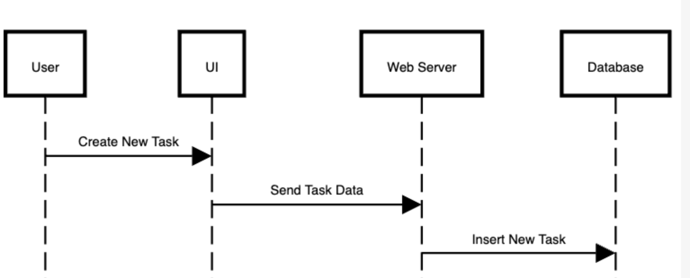

# Milestone #3

# Architecture Diagram

# Sequence Diagram

### Fetch Task List

### Create New Task

### Edit Existing Task

### Delete Task

# DFD

# Detailed List of Tasks

1. **Design main task management interface layout for UI.** - _Author: AR_
2. **Create mockups for task management screen for review.** - _Author: AS_
3. **Implement basic UI elements and navigation for the task page.** - _Author: SJ_
4. **Develop user-friendly navigation for task categories and priorities.** - _Author: AR_
5. **Create form for adding new tasks with input validation.** - _Author: SJ_
6. **Develop form for editing existing tasks with error handling.** - _Author: AS_
7. **Implement form for deleting tasks and confirmation prompt.** - _Author: AR_
8. **Add sorting options for tasks by due date and priority.** - _Author: SJ_
9. **Add filtering options for tasks by category and priority.** - _Author: AS_
10. **Set up reminder display and notification prompts in the UI.** - _Author: AR_

---

1. **Develop user registration form with server-side validation.** - _Author: SJ_
2. **Implement user login and logout functionality with secure sessions.** - _Author: AS_
3. **Set up password recovery and secure token generation.** - _Author: AR_
4. **Integrate session expiration and logout on inactivity.** - _Author: SJ_

---

1. **Create backend CRUD operations for tasks (create, read, update, delete).** - _Author: AR_
2. **Implement backend support for priority, category, and reminder settings.** - _Author: AS_
3. **Validate input for task fields like title, due date, and priority.** - _Author: SJ_

---

1. **Add backend logic for sorting tasks by due date, priority, and category.** - _Author: AR_
2. **Enable backend filtering of tasks by categories and priorities.** - _Author: SJ_
3. **Implement dynamic updates on task changes using Observer Pattern.** - _Author: AS_

---

1. **Create feature to allow users to share tasks with collaborators.** - _Author: AR_
2. **Develop notification system for updates to shared tasks.** - _Author: SJ_
3. **Build interface for managing collaborators and setting permissions.** - _Author: AS_

---

1. **Develop notification system to send reminders for task due dates.** - _Author: SJ_
2. **Allow user customization for reminders and notifications.** - _Author: AR_
3. **Integrate reminder settings in task creation and editing forms.** - _Author: AS_

---

1. **Design database schema for tasks, categories, users, and permissions.** - _Author: AR_
2. **Implement data encryption for sensitive user information.** - _Author: SJ_
3. **Set up data backup and recovery processes for the database.** - _Author: AS_

---

1. **Configure CI/CD pipeline for automated building and testing.** - _Author: SJ_
2. **Write unit tests for CRUD operations, sorting, and sharing features.** - _Author: AR_
3. **Develop integration tests for task management and notifications.** - _Author: AS_
4. **Conduct performance testing for task load and notification handling.** - _Author: SJ_

# Test Plan

### Overview

The ToDo App test plan aims to validate the app's core functionalities, ensuring a smooth user experience, data integrity, and security. This test plan covers unit, integration, system, and acceptance testing to ensure each feature aligns with the requirements.

---

### 1. **Unit Testing**

Unit Testing verifies the functionality of individual components in isolation. The goal is to ensure each function and method works as expected, given different inputs.

### Scenarios

| Test Case ID | Description                                     | Expected Result                                                 | Contributor | Pass/Fail |
| ------------ | ----------------------------------------------- | --------------------------------------------------------------- | ----------- | --------- |
| **UT-1.1**   | Test task creation function with valid input    | Task created with all provided details and returns success code | AR          | Pass      |
| **UT-1.2**   | Test task creation with missing required fields | Returns error message for missing field(s)                      | SJ          | Pass      |
| **UT-1.3**   | Test task deletion function with valid task ID  | Task is deleted successfully and removed from the database      | AS          | Pass      |
| **UT-1.4**   | Test task deletion with invalid task ID         | Returns error message indicating task not found                 | AR          | Pass      |
| **UT-1.5**   | Test sorting function by due date               | Tasks are sorted in ascending order of due date                 | SJ          | Pending   |
| **UT-1.6**   | Test sorting function by priority               | Tasks are sorted by priority (e.g., High, Medium, Low)          | AS          | Pending   |
| **UT-1.7**   | Test reminder setting function for a task       | Reminder is set and returns success code                        | AR          | Pending   |
| **UT-1.8**   | Test login function with valid credentials      | User is logged in, session is created                           | SJ          | Pending   |
| **UT-1.9**   | Test login with incorrect password              | Returns error message for invalid credentials                   | AS          | Pending   |
| **UT-1.10**  | Test registration with duplicate username       | Returns error message indicating username already exists        | AR          | Pending   |

---

### 2. **Integration Testing**

Integration Testing verifies that different components of the app work together correctly. This includes testing interactions between the UI, backend, and database, as well as cross-component features like notifications and task sharing.

### Scenarios

| Test Case ID | Description                                                   | Expected Result                                                  | Contributor | Pass/Fail |
| ------------ | ------------------------------------------------------------- | ---------------------------------------------------------------- | ----------- | --------- |
| **IT-2.1**   | Verify task creation from UI to backend and database          | Task is created on UI, saved in database, and displayed on UI    | SJ          | Pending   |
| **IT-2.2**   | Test task editing from UI and reflected in database           | Task edits are saved and updated correctly on UI and database    | AR          | Pending   |
| **IT-2.3**   | Verify task deletion from UI and database update              | Task deletion request removes task from database and UI          | AS          | Pending   |
| **IT-2.4**   | Test reminder notifications for shared tasks                  | Notifications are sent to all collaborators                      | AR          | Pending   |
| **IT-2.5**   | Validate login session management with Authentication Service | Valid session is maintained and expired after logout             | SJ          | Pending   |
| **IT-2.6**   | Verify integration of sorting function between backend and UI | Tasks are sorted in UI as per backend-sorted data                | AR          | Pending   |
| **IT-2.7**   | Test CI/CD pipeline for deploying changes                     | Updates are deployed successfully without breaking functionality | SJ          | Pending   |

---

### 3. **System Testing**

System Testing evaluates the app’s complete functionality in an end-to-end manner. This includes verifying that the entire app works as expected in a production-like environment, covering major features and workflows.

### Scenarios

| Test Case ID | Description                                      | Expected Result                                                 | Contributor | Pass/Fail |
| ------------ | ------------------------------------------------ | --------------------------------------------------------------- | ----------- | --------- |
| **ST-3.1**   | Full task management flow (create, edit, delete) | User can create, edit, and delete tasks without issues          | SJ          |           |
| **ST-3.2**   | Task sharing with collaborator                   | Task is shared, collaborator can view/edit based on permissions | AR          |           |
| **ST-3.3**   | Task notifications for due dates                 | Notifications appear at scheduled times as per user settings    | AS          |           |
| **ST-3.4**   | Verify reminder customization                    | Reminders can be customized and work as expected                | AR          |           |
| **ST-3.5**   | Test sorting and filtering across multiple tasks | Tasks are correctly sorted and filtered in UI                   | SJ          |           |
| **ST-3.6**   | Verify data backup and recovery functionality    | Data is backed up and can be restored successfully              | AR          |           |
| **ST-3.7**   | Cross-platform compatibility test                | App performs consistently across desktop, mobile, and tablet    | SJ          |           |

---

### 4. **Acceptance Testing**

Acceptance Testing validates that the app meets all requirements and is ready for release. This testing involves verifying that the ToDo App meets both functional and non-functional requirements as defined in the project scope.

### Scenarios

| Test Case ID | Description                                      | Expected Result                                                | Contributor | Pass/Fail |
| ------------ | ------------------------------------------------ | -------------------------------------------------------------- | ----------- | --------- |
| **AT-4.1**   | Verify user registration and authentication      | Users can register and log in without issues                   | AR          |           |
| **AT-4.2**   | Verify task creation, viewing, and deletion      | Users can create, view, and delete tasks reliably              | SJ          |           |
| **AT-4.3**   | Ensure task sharing functionality is intuitive   | Users can share tasks with collaborators easily                | AS          |           |
| **AT-4.4**   | Verify notifications are sent for due tasks      | Users receive timely notifications for upcoming tasks          | AR          |           |
| **AT-4.5**   | Confirm customization options for reminders      | Users can customize reminders and settings                     | SJ          |           |
| **AT-4.6**   | Ensure secure storage of user data               | All user data is encrypted and stored securely                 | AS          |           |
| **AT-4.7**   | Check usability and accessibility standards      | UI is intuitive, accessible, and easy to navigate              | SJ          |           |
| **AT-4.8**   | Validate CI/CD pipeline for production readiness | Updates are deployed successfully with no issues               | AS          |           |
| **AT-4.9**   | Ensure consistent performance under high load    | App performs well even under heavy usage and large task volume | AR          |           |
